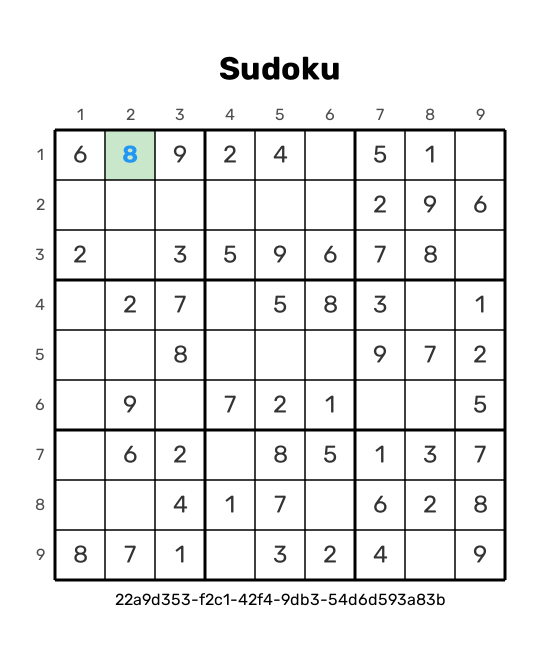
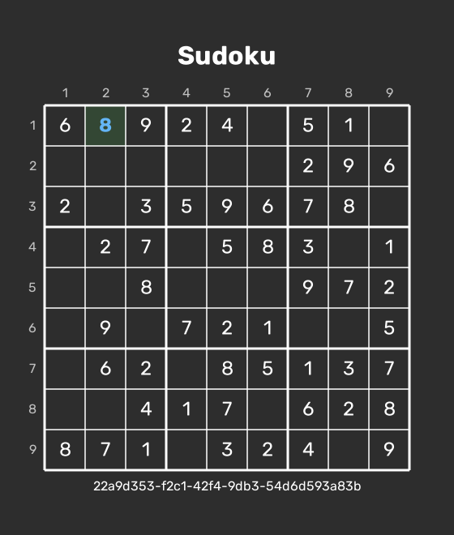

<div align="center">

# 🎮 Sudoku Game

A modern, responsive Sudoku game with a sleek interface and smooth user experience. Play, save, and download your games with full touch and keyboard support.

<div style="display: flex; justify-content: center; gap: 16px; margin: 20px 0;">
  
  
</div>

</div>


## ✨ Features

### Core Gameplay

- 🎯 Three difficulty levels: Easy, Medium, and Hard
- 🎨 Beautiful, responsive design
- 🌓 Light and dark theme support
- 📱 Works on desktop and mobile devices

## 📖 In this README

- [Features](#-features)
- [Getting Started](#-getting-started)
- [How to Play](#-how-to-play)
- [Themes](#-themes)
- [Updates & Roadmap](#-updates--roadmap)
- [Contributing](#-contributing)
- [License](#-license)
- [Acknowledgments](#-acknowledgments)
- [Contact](#-contact)

### Game Features

- ⌨️ Full keyboard navigation support
- 🔢 Virtual number pad
- ⏱️ Real-time game timer
- ❌ Mistake tracking (max 3)
- 💾 Save and resume games
- 🖼️ Download game state as image
- ✅ Move validation

### User Experience

- 🎯 Intelligent cell highlighting
- 🎨 Color-coded user inputs
- ⚡ Smooth animations
- 🔄 Retry functionality
- 📝 Game ID sharing

## 🚀 Getting Started

### Prerequisites

- Node.js (v14 or higher)
- npm (v6 or higher)

### Installation

1. Clone the repository

```bash
git clone https://github.com/kogakisaki/koga-sudoku
```

2. Install dependencies

```bash
cd koga-sudoku
npm install
```

3. Start the server

```bash
npm start
```

4. Open in browser

```code
http://localhost:3000
```

## 🎮 How to Play

### Start a New Game

- Click `New Game`
- Choose difficulty level
- Start playing!

### Game Controls

- Use number keys (1-9) or virtual keypad
- Navigate cells with arrow keys
- Delete numbers with Backspace/Delete
- Use the eraser button on virtual keypad

### Save & Resume

- Each game has a unique Game ID
- Save the ID to continue later
- Use "Load Game" with the ID

### Features

- Check progress with `Check`
- Retry game with "Retry"
- Download board state as image
- Toggle theme with moon/sun icon

## 🎨 Themes

The game supports two themes:

- ☀️ Light Theme (Default)
- 🌙 Dark Theme

Switch themes using the theme toggle button in the top-right corner.

## 🔄 Updates & Roadmap

### Recent Updates

- Added user input highlighting
- Improved deletion functionality
- Enhanced theme support
- Added image download feature
- Improved mobile responsiveness

### Future Plans

- Online multiplayer
- Game statistics
- Achievement system
- Custom themes
- Advanced tutorials

## 🤝 Contributing

Contributions are welcome! Please feel free to submit a Pull Request.

1. Fork the project
2. Create your feature branch
3. Commit your changes
4. Push to the branch
5. Open a Pull Request

## 📜 License

This project is licensed under the `MIT License` - see the LICENSE.md file for details.

## 👏 Acknowledgments

- Font Awesome for icons
- Google Fonts for Rubik font family
- The Sudoku community for inspiration

## 📧 Contact

- Discord: kogakisaki
