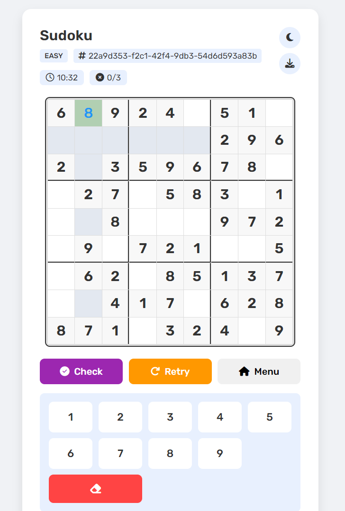
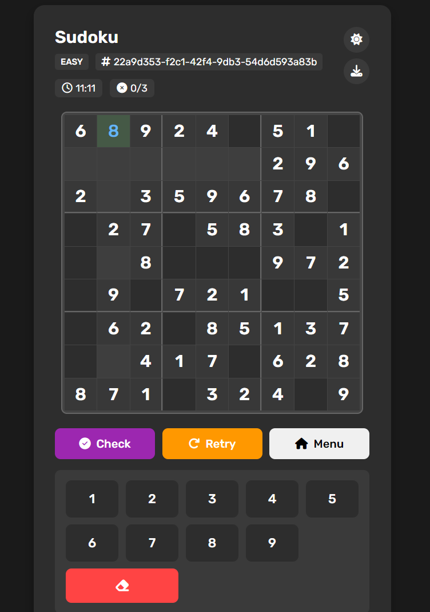

<div align="center">

# 🎮 Sudoku Game

A modern, responsive Sudoku game with a sleek interface and smooth user experience. Play, save, and download your games with full touch and keyboard support.

<div style="display: flex; justify-content: center; gap: 16px; margin: 20px 0;">
  
  
</div>

</div>


## ✨ Features

### Core Gameplay

- 🎯 Three difficulty levels: Easy, Medium, and Hard
- 🎨 Beautiful, responsive design
- 🌓 Light and dark theme support
- 📱 Works on desktop and mobile devices

### Game Features

- ⌨️ Full keyboard navigation support
- 🔢 Virtual number pad
- ⏱️ Real-time game timer
- ❌ Mistake tracking (max 3)
- 💾 Save and resume games
- 🖼️ Download game state as image
- ✅ Move validation

### User Experience

- 🎯 Intelligent cell highlighting
- 🎨 Color-coded user inputs
- ⚡ Smooth animations
- 🔄 Retry functionality
- 📝 Game ID sharing

## 🚀 Getting Started

### Prerequisites

- Node.js (v14 or higher)
- npm (v6 or higher)

### Installation

## Clone the repository

```bash
git clone https://github.com/kogakisaki/koga-sudoku
```

## Install dependencies

```bash
cd sudoku-game
npm install
```

## Start the server

```bash
npm start
```

## Open in browser

```code
http://localhost:3000
```
